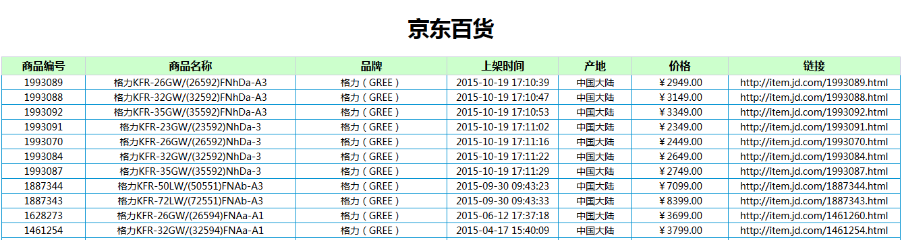
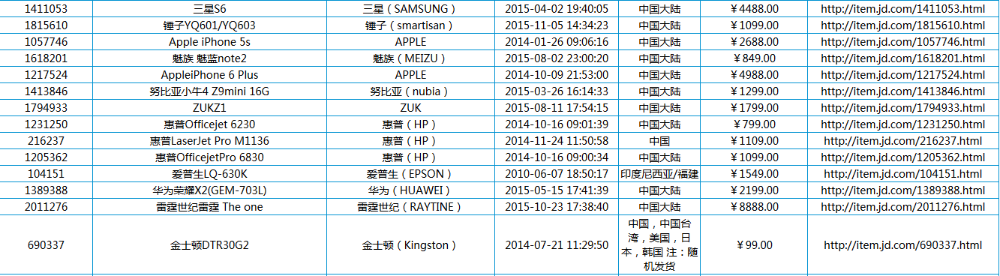
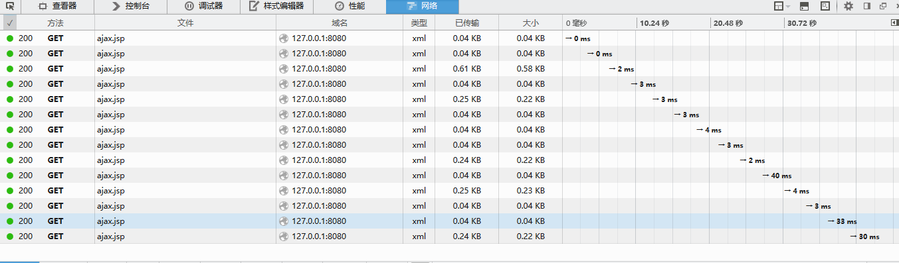
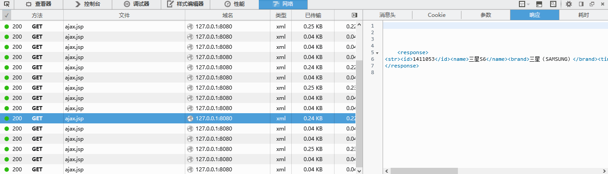
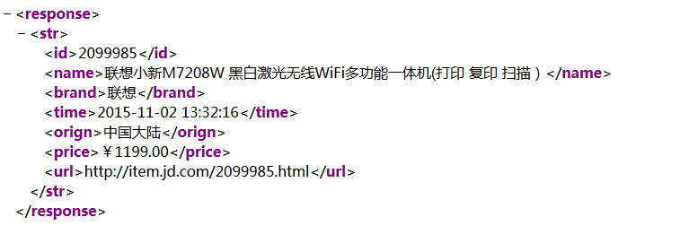
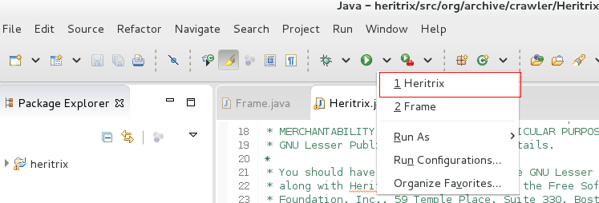
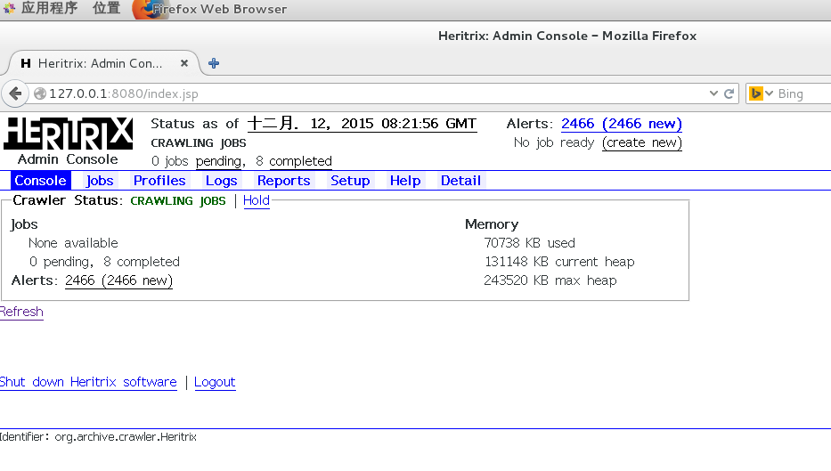

# Heritrix-based-web-crawler-for-JD
##1. 介绍
这是一个基于heritrix爬虫框架的网络爬虫，爬取的信息是京东上的商品信息，包括商品编号，名称，品牌，价格，上市时间，产地，链接的信息。
##2. 设计与实现
普通的网络爬虫只是单纯的下载网站目录下的网页文件，而不会解析网页的内容，
更不会执行网页中包含的javascript代码。
这就导致了普通的网络爬虫不能抓取网页上的动态内容，在本系统实现的过程中，
京东商品信息中的价格是动态生成的，用户在用浏览器访问商品页面的时候，
浏览器首先会执行网页上的javascript代码，执行这些代码之后生成动态数据，
将动态数据显示在网页上，因此用户通过浏览器可以看到网页上的所有数据。
###2.1 解析JavaScript代码
本系统在解析网页内容之前，首先模拟了浏览器执行javascript的过程，
执行了网页上的javascript代码，生成了动态的数据，然后再解析网页的内容，
抽取出想要的信息。模拟浏览器执行javascript代码并返回完整网页的过程如下所示。

      WebClient wc = new WebClient();
		wc.getOptions().setJavaScriptEnabled(true); // 启用JS解释器，默认为true
		wc.getOptions().setCssEnabled(false); // 禁用css支持
		wc.getOptions().setThrowExceptionOnScriptError(false); // js运行错误时，是否抛出异常
		wc.getOptions().setTimeout(5000); // 设置连接超时时间 ，这里是5S。如果为0，则无限期等待
		HtmlPage page = wc.getPage(url);
		wc.close();
		String pageXml = page.asXml(); // 以xml的形式获取响应文本
###2.2 提取网页信息
得到网页的文本之后，用jsoup来解析网页内容，
提取出有用的信息。jsoup 是一款Java 的HTML解析器，
可直接解析某个URL地址、HTML文本内容。它提供了一套非常省力的API，
可通过DOM，CSS以及类似于jQuery的操作方法来取出和操作数据。
本系统中提取京东商品信息的过程如下所示。

      Document doc = Jsoup.parse(pageXml);
		Elements attrs = doc.select("ul#parameter2");
		Element p = doc.select("strong#jd-price.p-price").first();
		String price = p.text();
		Element e_ID = attrs.select("li:contains(编号)").first();
		String id = e_ID.attr("title");
      Element e_Name = attrs.select("li:contains(名称)").first();
		String name = e_Name.attr("title");
		Element e_Brand = attrs.select("li:contains(品牌)").first();
		String brand = e_Brand.attr("title");
      Element e_Time = attrs.select("li:contains(上架时间)").first();
		String time = e_Time.attr("title");
		Element e_Origin = attrs.select("li:contains(产地)").first();
		String orign = e_Origin.attr("title");
		Model goods = new Model(id, name, brand, time, orign, price, url);
		return goods;

###2.3 实时显示抓取结果

本系统在Heritrix操作栏的基础上添加了一个“Detail”选项，
点击这个链接会进入京东商品信息的显示页面，
商品信息的显示页面如下图所示。

商品信息页面上表格里显示的就是爬虫抓取到的京东的商品信息，
爬虫抓取到这些商品信息时，以行为单位存储到一个队列里，
前台的显示页面会每隔五秒访问一次队列，如果队列不为空，
就从队列里取出一条商品信息并显示在页面的表格里，
这时表格也就会自动的新增一行，抓取的结果如下图所示

这里是用ajax的技术实现的异步刷新，达到不刷新网页也能让网页与服务器交互的目的。
前台页面访问服务器的实现异步刷新的过程如下图

前台页面访问服务器之后，服务器以xml的形式返回响应。返回响应的格式和内容如下图

实现异步刷新的javascript代码如下所示：

       var XMLHttpReq;  
           //创建XMLHttpRequest对象         
            function createXMLHttpRequest() {  
            if(window.XMLHttpRequest) { //Mozilla 浏览器  
                XMLHttpReq = new XMLHttpRequest();  
            }  
            else if (window.ActiveXObject) { // IE浏览器  
                try {  
                    XMLHttpReq = new ActiveXObject("Msxml2.XMLHTTP");  
                } catch (e) {  
                    try {  
                        XMLHttpReq = new ActiveXObject("Microsoft.XMLHTTP");  
                    } catch (e) {}  
                }  
            }  
        }  
        
        //发送请求
        function sendRequest() {  
            createXMLHttpRequest();  
            var url = "ajax.jsp";  
            XMLHttpReq.open("GET", url, true);  
            XMLHttpReq.onreadystatechange = processResponse;//指定响应函数  
            XMLHttpReq.send(null);  // 发送请求  
        }  
        
        // 处理返回信息函数  
        function processResponse() {  
            if (XMLHttpReq.readyState == 4) { // 判断对象状态  
                if (XMLHttpReq.status == 200) { // 信息已经成功返回，开始处理信息  
                	addRow(tbNew);  
                    setTimeout("sendRequest()", 3000);  
                } else { //页面不正常  
                    window.alert("您所请求的页面有异常。");  
                }  
            }  
        }  

在爬虫取得服务器的响应之后，
前台的javascript代码负责处理数据并且使表格新增一行，
在新增的这一行中显示从服务器获取的数据。

##3. 运行
在eclipse中找到本系统的Heritrix类，运行这个类，在控制台可以看到服务器的启动过程，如下图所示。

服务器启动之后，地址栏里输入127.0.0.1：8080，可以在浏览器中打开本系统，如下图所示。

